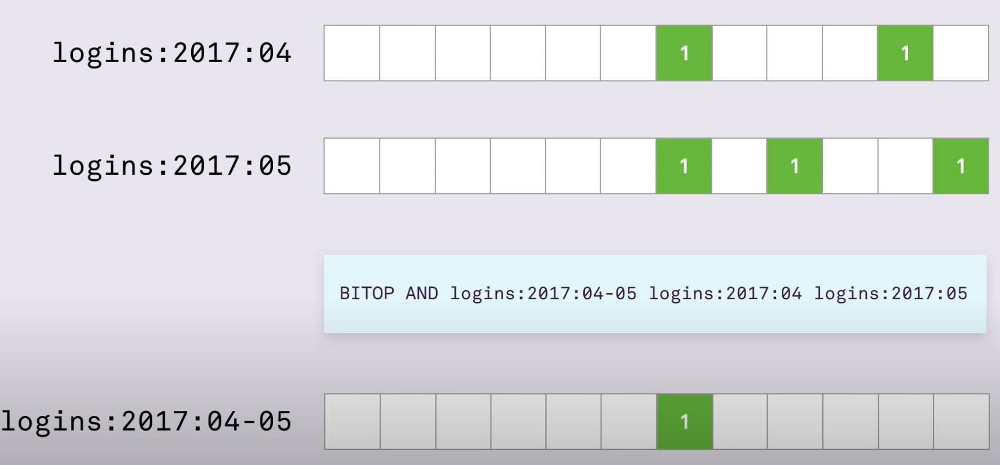
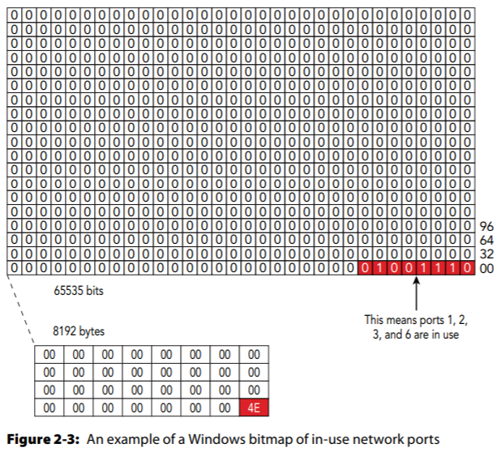
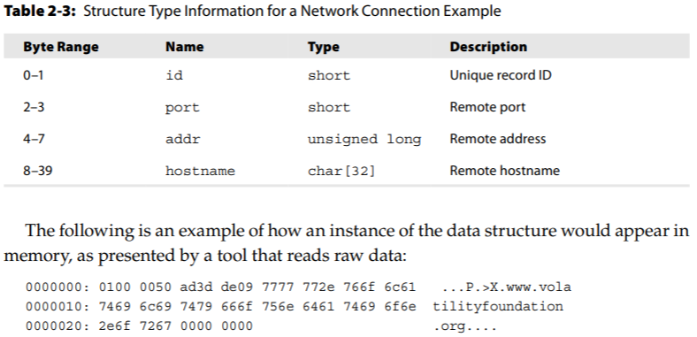
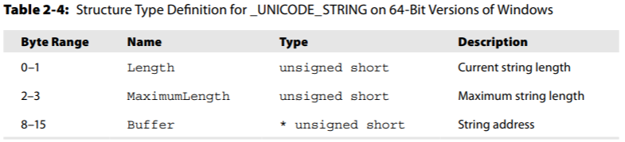

# AoMF: Data Structures


## Bitmaps

- Good for user retention
- Or in Forensics: allocated versus free memory, low versus high priority, etc.

- Key : Binary_value and Boolean logical operations



- Redis uses it
- Windows kernel also uses a bitmap to maintain allocated network ports
  - The first index has a value of 4e hexadecimal, which translates to 1001110 binary. This binary value indicates that ports 1, 2, 3, and 6 are in use, because those are the positions of the bits that are set.



## Records

- Can have different types of elements comprised in each structure. Each record is a collection of `<name, element>` pairs (aka members).

- One way it is used is for *Network connection records* as 

  ```c
  struct Connection {
   short id;
   short port;
   unsigned long addr;
   char hostname[32];
  };
  ```

  


## Strings

- Have length, maxLength, and the string's address




## Embedded Doubly Linked List

- *embedded* here means it leverages internal storage to embed a *_LIST_ENTRY* structure within the element being stored.

- `Flink`, or forward link and `Blink`, or backward link


## Trees

- Windows memory manager uses Virtual Address Descriptor (VAD) trees as lookups of memory ranges used by a process
  - VADs are *self-balancing binary trees* -  Intuitively, this means that nodes containing lower memory address ranges are found in a node’s left subtree, and nodes containing higher ranges are found  in the right subtree

