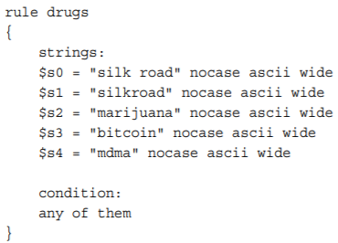

# AoMF: Memory Acquisition

[The Tools](#The-Tools)

[Steps to Recover the Hibernation File and PageFile](#Steps-to-Recover-the-Hibernation-File-and-PageFile)

[Steps to Extract Registry Hives](#Steps-to-Extract-Registry-Hives)

- The *capturing, dumping, sampling, or copying* the contents of volatile memory to non-volatile storage while minimizing the "distortion" to the file system.
- Chain of Custody: Don't forget to hash.
- Using data 'on disk' and in RAM
- Do **NOT** power off the machine!
- Should prioritize acquisition by order of volatility ([pic](https://mk0gcgablogq2ifx558u.kinstacdn.com/wp-content/uploads/2016/08/OrderOfVolatility.png))
- Can use Direct Memory Access (DMA) if the machine is not a VM and it is running, if you do not have root suing hardware such as [Firewire](https://www.amazon.com/Firewire-Adapters/b?ie=UTF8&node=3015396011), ExpressCard, [USB](https://www.cru-inc.com/products/wiebetech/usb_writeblocker/), or [PCI](https://www.guidancesoftware.com/tableau/hardware/t7u). Enter Write-Blockers.
- Decisions must be made: Remote vs Local, Acqusition vs runtime interrogation, which format, etc.
- **There is always risk in acquiring memory; make sure to inform the owner of the system of all the consequences and decide who is actually bearing the risk.**
- Atomicity

#### Device Memory

-  On x86/x64–based computers, the firmware (BIOS) provides a physical memory map to the OS with different regions marked as reserved
-  ` MmGetPhysicalMemoryRanges` - using this API avoids the device-memory regions. However, reading from this is dangerous because this may/will alter the state of the device you're accessing.
-  How dangerous?
   -  Ex 1: There are physical addresses that are mapped to device registers that change the state of the device each time the physical location is read. This might confuse device drivers or firmware that depend on those register values and could cause the system to freeze.
   -  Ex 2: Also, a freeze is especially common when addresses occupied by the video chipset, High Precision Event Timer (HPET), or obscure, legacy PCI devices are read.
-  What can you get from acquiring device-memory regions?
   - The real mode interrupt vector table (IVT); could contain artifacts from firmware-based rootkits ([IVT reading](https://en.wikipedia.org/wiki/Interrupt_vector_table))
   - Evidence of BIOS rootkits that inject code at the top of real mode memory ([Further reading](https://en.wikipedia.org/wiki/Rootkit))
   - Use the CMOS region to change the boot order
   - Use the IOAPIC indirect access registers to re-route interrupts ([Further reading](http://www.osdever.net/tutorials/view/advanced-programming-interrupt-controller))
-  *KnTDD* is the trusted tool, based on this book; **too bad the site is down.**

#### Cache Coherency

-  A page table entry may be programmed with different memory cache attributes (non-cached, cached, write-combined) that determine the way in which the processor accesses a physical memory page. Moreover, being that these caches have design limitations which make acquisition dangerous. How dangerous?
   - Can corrupt the Translation Lookaside Buffer
   - Corruption of the data at the specified memory address
-  **Cache coherency** is one of the major reasons why Microsoft cautions Windows driver developers not to map physical pages unless their driver has directly allocated the memory through an API that guarantees no other system component has mapped the same memory range with a different caching type (http://msdn.microsoft.com/en-us/library/ windows/hardware/ff566481%28v=vs.85%29.aspx)
-  `ZwMapViewOfSection` supposedly protects against cache conflicts; **it does not**, especially if a memory page is not currently allocated.
-  Current versions of Windows silently (no warning like in Win7 and Win'08R2) substitute the cache attributes that are stored in the [PFN database](https://rayanfam.com/topics/inside-windows-page-frame-number-part1/), even if the target page is not currently allocated and values in the corresponding PFN database entry are no longer valid.
-  In summary, there really isn't an approved, reliably safe method for copying memory (pages).

### How to Acquire Memory

1. Local to Removable Media (USB, ESATA, or Firewire drive)

   - *It is never recommended to dump memory to the target system’s local drives, such as the C: partition, because this will overwrite a significant amount of evidence that may be relevant to your case*
   - Ensure the destination drive is formatted with NTFS or other high-performance file system
   - Don't use same storage device on multiple compromised systems
   - Use an intermediate device to copy data from removable media to actual forensics work station
   - Sterilize removable media after use

2. Remote

   - Push tools over a network to target machine (ex: via PsExec or via SMB shares)
   - Then while sending back the data (using ex: netcat, CryptCat, KnTDD, F-Response Enterprise, SMB **3.0**), data should be encrypted
   - Remember best effort when discussing chain-of-custody implications. 
   - Must consider Pass-the-Hash attacks:
     - Recommended to create a temporary admin account and then close it after the investigation and monitor its cred use like a honeypot
     - Could also use firewall or router rules to block all network comms except for the connection to-and-from your forensic workstation and the target system.
   - Make sure to compress with a password (easily done in something like 7zip)

3. Runtime interrogation

   - Check for specific indicators over a large network in memory
   - Commercial suites like F-Response, AccessData Enterprise, and EnCase Enterprise do this

4. Hardware Acquisition

   - Vol.py supports acquisitions and interrogation over Fireware; need Juju Firewire stack and `vol.py -l firewire://` instead of `vol.py -f <filename>` - then use `vol.py imagecopy` and even then only 4GB limit transfer
   - Could also unlock the workstation via a tool like [Inception](https://github.com/carmaa/inception). However, if the tool can't find the necessary instructions for patching the login subroutine then the tool won't work.

   #### Software Tools for Acquisition

   They all follow a similar protocol: 1) load a kernel module that maps the desired physical addresses to the virtual address space of a task 2) Access the data from the virtual address space and write it to another storage location for processing.

   The mapping (Step 1) can occur by either:

   1. Using an OS API to create a new page table entry `ZwMapViewOfSection` (on \Device\PhysicalMemory), `MmMapIoSpace`, `MmMapLockedPagesSpecifyCache`, and `MmMapMemoryDumpMdl`.
   2. Using an OS API to create an empty page table entry and manually encode the desired physical page into the page table entry.

   Risks to both approaches:

   - None of these methods were intended to map pages that a driver does not own
   - Difference in memory management techniques. Ex:
     -  `ZwMapViewOfSection` maps the specified physical address into the user mode address space
     -  Others will map the physical address into the kernel-mode address space

   **Anti-Forensics** - [PTE remapping](http://blog.rekall-forensic.com/2018/09/virtual-secure-mode-and-memory.html#PTE%20Remapping%20Vs.%20MmMapIoSpace) bypasses malware/OS safeguards ([Book src](https://dfrws.org/sites/default/files/session-files/paper-anti-forensic_resilient_memory_acquisition.pdf))

   Another difference is the method used to include or exclude certain physical addresses:

   1. Some will start at 0x0000 and go until the "expected" page size is hit
   2. Others could also skip device memory regions to make the acquisitions safer
   3. Others will include device memory regions to get a more wholistic picture of a system

   - The goal is to find a tool that can capture device memory regions safely. However the problem is none of these tools have been tested at-length for the purpose of creating formal specifications.
     - Of note, virtualized platforms are more predictable than their hardware counterparts

When choosing a tool it must "acquire evidence in a manner that is accurate, complete, documented, and with robust error logging." The problem with many tools is they silently fail preventing investigators from realizing the problem until they go back to their labs to analyze the data. To aid in this uncertainty you can use the [Microsoft driver verifier tool](https://support.microsoft.com/ kb/244617).

### The Tools

- GMG Systems, Inc., KnTTools: can acquire ROM/EEPROM/NVRAM from the BIOS and peripheral device memory (PCI, video card, network adapter). **Can't find anywhere.**
- F-Response: Interrogation is a nice feature with endpoints installed on every host.
- Mandiant Memoryze: Can easily run from removable media. Can Export XML output to Redline companion tool.
- HBGary FastDump:  claims to leave the smallest footprint
- MoonSols Windows Memory Toolkit: Uses Win32dd, Win64dd, and DumpIt.
- AccessData FTK Imager: A very pay-for-it-all type of utility.
- EnCase/WinEn: Most known as E01. Can also do remote interrogation with its enterprise version ($$$)
- Belkasoft Live RAM Capturer: Circumvents aggressive anti-debugging and anti-dumping mechanisms all from USB.
- ATC-NY Windows Memory Reader: Can easily be sent over-the-wire (with netcat).
- Winpmem: Only* open-source memory acquisition tool for Windows
- KAPE: For host forensics collection
- [More as of 9/26/19](https://www.group-ib.com/blog/digital_forensics_tools)

### Memory Dump Formats

Volatility uses address space voting rounds to automatically identify the file format for you; handles raw dumps, Crash dumps, Hibernation files, EWF/E01, HPAK, Mach-o, VMware, and VirtualBox. 

Crash dump file locations:

1. `%SystemRoot%\MEMORY.DMP` or you can change path via `SYSTEM/CurrentControlSet\Control\CrashControl`. 
2. Software\Microsoft\Windows\Windows Error Reporting` for user-mode crash dump (note it is not a complete dump so won't work with Vol.py).
3. Volume Shadow Copy Service (VSS)!

- **Raw memory dump** (does not contain any headers, metadata, or magic values for file type identification) that includes padding for intentionally skipped memory ranges to maintain spatial integrity (relative offsets).

- **Windows Crash Dump**: designed for debugging purposes. Crash dumps begin with a `_DMP_HEADER` or `_DMP_HEADER64` structure with Signature being either  `PAGEDUMP` or `PAGEDU64`. For Volatility, dump must be a complete memory dump, **not** a kernel memory dump or a small dump. [More on understanding crash dump files](https://techcommunity.microsoft.com/t5/ask-the-performance-team/understanding-crash-dump-files/ba-p/372633)

  1. Blue Screens: Can test with [NotMyFault from Sysinternals](http://download.sysinternals.com/files/NotMyFault.zip), which includes an intentionally buggy driver that causes a BSoD. Of course, this method powers down the system hard, which might result in loss of other data.
  2. CrashOnScollControl: Some keyboards have special key sequences that produce a crash dump (see [KB 244139](https://support.microsoft.com/en-us/help/244139/windows-feature-lets-you-generate-a-memory-dump-file-by-using-the-keyb))
  3. Debuggers: using a remote kernel debugger (WinDBG), you can use the .crash or .dump commands. Rarely applies for Forensics.
     - These above don’t include device memory regions or the first physical page, which might contain a copy of the Master Boot Record (MBR) from disk and pre-boot authentication passwords. Also, they can be subverted by malware that registers a bug check callback.
     - MoonSols MWMT can create its own crashdump  compatible with the WinDBG debugger (and Vol.py) but don't use the same kernel dump techniques thus missing the first page, subversion via callbacks, and size limitations are avoided.
     - Volatility and KnTDD can also convert raw memory dumps into crash dumps

- **Windows Hibernation File:** (hiberfil.sys) is a compressed copy of memory. Includes a header (`PO_MEMORY_IMAGE`), [CR3 register](#Introduction), and *compressed* data blocks. [More info at KB 920730](https://support.microsoft.com/en-us/help/920730/how-to-disable-and-re-enable-hibernation-on-a-computer-that-is-running)

  - Sometimes the header is zero'd out (happens when the system resumes) breaking hibfile tool analysis.
  - **Note** right before system hibernates the DHCP configurations are released so you will not have complete networking artifacts to work with. Also, (in-memory) malware can remove itself at this time.
  - Tool: [Sandman video](https://media.blackhat.com/bh-usa-08/video/bh-us-08-Suiche/black-hat-usa-08-suiche-windowshibernation-hires.m4v) ([Slides](https://www.blackhat.com/presentations/bh-usa-08/Suiche/BH_US_08_Suiche_Windows_hibernation.pdf)) 

- **Virtual Machine Memory** - can use [actaeon](https://github.com/eurecom-s3/actaeon), however it is a decade old at this point with no current development on GitHub.

  

#### Steps to Recover the Hibernation File and PageFile

> $mmls image.dd # to find start of FS of interest
>
> $fls -o [start of fs] image.dd | grep hiber # to find hiberfil.sys inode
>
> $fls -o [start of fs] image.dd | grep pagefile #to find pagefile inode
>
> $icat -o [start of fs] image.dd [inode] > /external/media/device/location

#### Steps to Extract Registry Hives

> $fls -o [start of fs] -rp image.dd | grep -i config/software$ # to find software hive inode
>
> $fls -o [start of fs] -rp image.dd | grep -i config/system$ # to find system hive inode
>
> $icat -o [start of fs] image.dd [inode] > /external/media/device/location
>
> #Then analyze with registry parser like RegRipper or [RegLookup](http://projects.sentinelchicken.org/reglookup/)

#### Analyzing Page Files

-  OS transparently writes parts of the memory to disk during routine operations such as paging!
-  Vol.py can't do this, though [Andrea Fortuna](https://www.andreafortuna.org/2019/04/17/how-to-extract-forensic-artifacts-from-pagefile-sys/) found a way. Or you can do it with Yara then load into Vol.py to search: `$python page_brute-BETA.py -r drugs.yar -f /media/external/pagefile.sys`

