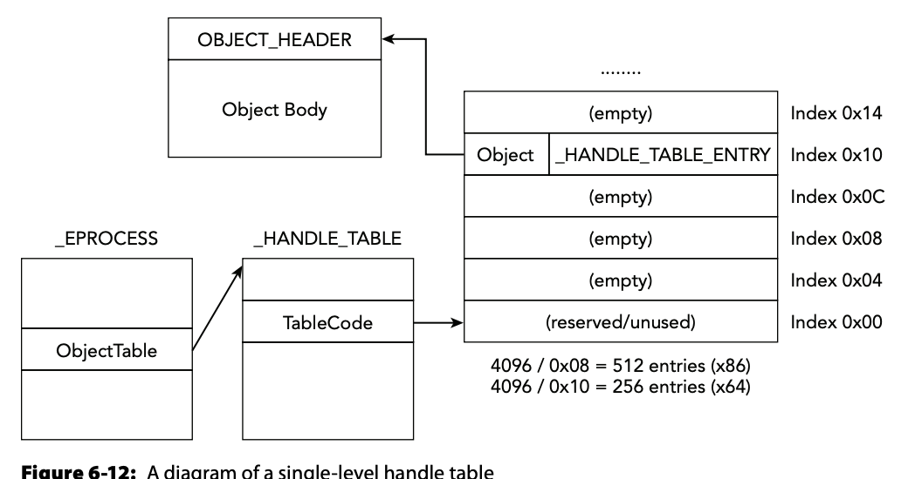

# Processes, Handles, and Tokens

## Summary

- [Processes](#Processes) are represented as `_EPROCESS` structs
  - The `_LIST_ENTRY` is what is *walked* by manly process enumerations tools (e.g., Task Manager)
  - [Known processes that should](#Critical-System-Processes) be on a system can be analyzed with `$vol.py psxview`
    - [Direct Kernel Object Manipulation](#Detecting-DKOM-Attacks) are a family of attacks which hide procs from enum tools; use psxview.
  - [Detect hidden processes](#Alternate-Process-Listing) - AoMF: "Realistically, it’s far easier to just inject code into a process that’s not hidden"
- [Process Tokens](#Process-Tokens) describe a proc's security context
  - [Detecting Lateral Movement](#Detecting-Lateral-Movement) and [Linking processes to user accounts](#Finding-SIDs):
    - By using getsids to associate a proc with a user account with [their SIDs](#Finding-SIDs) found in their [tokens](#Process-Tokens)
    - Many commonly exploited [privileges](#Privileges); to analyze use `$vol.py privs`
- [Handles, their lifetime, and how they work](#Process-Handles)
- [Detecting Registry Persistence](#Detecting-Registry-Persistence) via `$vol.py handles --object-type=Key --pid=1700` then confirm with `$vol.py printkey`
- [Identifying Remote Mapped Drives](#Identifying-Remote-Mapped-Drives) via `$vol.py handles -t File | grep Mup` and `vol.py symlinkscan`

---

## Processes

- `_EPROCESS` is a structure that represents a process.
  - Starts with the `Pcb` (process control block, aka `_KPROCESS`) which includes fields for address translation and "work time"
  - `ActiveProcessLinks` - most APIs rely on walking this doubly-linked list of active processes. This is a `_LIST_ENTRY` struct.
    - Other `_LIST_ENTRY` structs include: `SessionProcessLinks`, `JobLinks`, `ThreadListHead`, `MmProcessLinks`.
  - `PVOID Session` - stores information on user's logon session and GUI
  - `ImageFileName`
  - `ActiveThreads` - if zero, proc has exited. Can also corroborate with `ExitTime`.
  - `Peb` (Process Environment Block) exists in kernel point and points to an address in user mode. Contains lots of useful information including cwd, proc args, and many more!
  - `VadRoot` is the root node of the VAD tree including the original access permissions (RWX)

- **Handle table** is file descriptor table in *nix systems.

- Primary way Windows enforces security is with SID's

- Each proc has its own private virtual memory. Inside is:
  - the executable
  - list of loaded modules (DLLs and shared libraries)
  - stacks, heaps, .ro, user inputs, etc..
  - application-specific data structures (e.g. SQL Tables, config files, etc.)
- Windows organizes memory regions using virtual address descriptors (VADs)

### Process Organization

`_EPROCCESS` contains a [`_LIST_ENTRY`](datastructures.md#Embedded-Doubly-Linked-List)

- Tools like Process Explorer or Task Manager rely on walking this list via the ` NtQuerySystemInformation` API.

  

### Enumerating Processes in Memory

Vol.py steps when to list processes:

1. Locates kernel debugger data block (aka `_KDDEBUGGER_DATA64`)
2. Access ` PsActiveProcessHead` member which points to the head of the `EPROCESS` structures

Another way is to do the pool-scanning approach [(by their tags)](windowsmem4n6.md#Pool-Tag-Scanning). If we recall, this method of walking these `_LIST_ENTRY`s is not advisable as it does **NOT** find non-active processes since they would have been freed from the list.

### Critical System Processes

[See Forensics Class slides 7-11](https://drive.google.com/file/d/1G6Qu0cgU9pYkiwU1quXQof2VLctqTLZv/view?usp=sharing)

1. `Idle` and `System`
   - **Not real processes as in they do not have corresponding**
     **executable on disk.**
   - Idle is just a container that the kernel uses to charge CPU time
     for idle threads. 
   - System serves as the default home for threads that run in kernel mode. Thus, the System process (PID 4) appears to own any sockets or handles to files that kernel modules open executables.
2. `Csrss.exe` 
   - Plays a role in creating and deleting processes and threads. It maintains a private list of the objects that you can use to cross-reference with other data sources. **Expect to see multiple CSRSS processes because each session gets a dedicated copy; however, watch out for attempts to exploit the naming convention (csrsss.exe or cssrs.exe). The real one is located in the system32 directory.**
3. `Services.exe`
   - Manages Windows services and maintains a list of such services in its private memory space. **This process should be the parent for any svchost.exe (service host) instances** 
   - **It should be running from the system32 directory.**
4. `Svchost.exe`
   - Provides a container for DLLs and implement services.
   - Will have multiple *shared* svchost processes
5. `Lsass.exe`
   - The *local security authority subsystem* process is responsible for enforcing the security policy, verifying passwords, and creating access tokens. 
   - Plaintext password hashes can be found in its private memory space. 
   - There should be only one instance of lsass.exe running from the system32 directory, and its parent is winlogon.exe on pre-Vista machines, and wininit.exe on Vista and later systems. 
   - Stuxnet created two fake copies of lsass.exe , which caused them to stick out like a sore thumb.
6. `Winlogon.exe`
   - This process presents the interactive logon prompt, initiates the screen saver when necessary, helps load user profiles, and responds to Secure Attention Sequence (SAS) keyboard operations such as CTRL+ALT+DEL . 
   - Also, this process monitors files and directories for changes on systems that implement Windows File Protection (WFP). As with most other critical processes, its executable is located in the system32 directory.
   - Similar to what `session` contains ([from above](#Processes))
7. `Explorer.exe`
   - **One process for each logged-on user.** 
   - Handles GUI-based folder navigation, presenting the start menu, and so on. 
   - It also has access the documents you open and credentials you use to log in to FTP sites via Windows Explorer.
8. `Smss.exe`
   - The *session manager* is the first real user-mode process that starts during the boot sequence. 
   - It creates the sessions that isolate OS services from the various users who may log on via the console or Remote Desktop Protocol (RDP). 
   - When either Winlogon or Csrss ends normally, the system shuts down; if it happens unexpectedly, Smss.exe causes the system to stop responding (hangs).

### Analyzing Process Activity

1. `$vol.py pslist`

   - Walks the `_LIST_ENTRY` ([see above](#Process-Organization))

2. `$vol.py pstree`

   - Takes output of *pslist* and puts in tree view.

3. `$vol.py psscan` 

   - Pool-scans `_EPROCCESS` object instead of just walking the `_LIST_ENTRY`
   - [Also here from my notes](windowsmem4n6.md#Building-a-Pool-Scanner)
   - Can make process tree visualization
     - Suggested method is: `$vol.py psscan \--output=dot  \-\-output-file=processes.dot` then open in [Graphviz](http://graphviz.org)

4. `$vol.py psxview`

   - Cross ('x') referencing alternate sources to find discrepancies.

   - [See seven sins of memory forensics](#Alternate-Process-Listing)

     

The following are other ways to find processes in a memory dump.

### Detecting DKOM Attacks

 **Direct Kernel Object Manipulation**

- Hide a process by unlinking its entry form the `_LIST_ENTRY` by simply overwriting the Flink and Blink pointers so they  point *around* the `_EPROCCESS` object.
  - Vol.py pslist is susceptible to this attack! **This is why it's better to use psscan, or just psxview.**

- Malware can modify kernel objects by:
  - Loading a kernel driver, which has unrestricted access to objects in kernel memory
  - Mapping a writable view of the `\Device\PhysicalMemory` object
  - Using ` ZwSystemDebugControl()` API

#### The Case of Prolaco

- Used psscan to find hidden processes dropped from malware via the `ZWSystemDebugControl()` API
- Nice trick to show differences in pslist and psscan commands: `$ cat pslist.txt psscan.txt | awk '{print $2"\t"$3}' | sort | uniq –c | grep –v “ 2”`
- [Prolaco memory analysis by dtic.mil](https://apps.dtic.mil/dtic/tr/fulltext/u2/1004197.pdf)

#### Alternate Process Listing

1. Walk active process (`ActiveProcessLinks` ) via`_LIST_ENTRY`; using *pslist*
2. Process object scanning - pool scanning
3. Thread scanning `_ETHREAD`
4. CSRSS Handle Table - critical system process creates every process and thread so just walk the handle table ([referenced here in my notes](#Processes))
5. PspCid Table - Special handle table located in kernel memory that stores references to all **ACTIVE** process and thread objects. It's a member of `_KDDEBUGGER__DATA`.
6. Session processes - A member of `_EPROCCESS` that associates processes to which user's logon session.
   - Since APIs don't depend on this, attackers won't usually change it.
7. Desktop Threads - part of `tagDesktop` struct which store all threads attached to each desktop and thereby map a thread back to its owning proc.

`vol.py psxview` enumerates all of the Alternate Process Listings directly above. If you supply the `--apply-rules` option, you might also see *Okay* in the columns, which indicates that although the process was not found, it meets one of the valid exceptions described in the following list:

AoMF: "Realistically, it’s far easier to just inject code into a process that’s not hidden"

## Process Tokens

A process' token describes its security context. The tokens include Security Identifiers (SID) of user/group a given proc is running as AND its privilege's (specific tasks).

With proc tokens you can:

###### Map SIDs to Users Names

​	by taking the SID value and resolve it into the user/group name

###### Detect Lateral Movement

​	with artifacts left behind by hacking techniques like pass-the-hash that alter security contexts to something like Domain or Enterprise Admin.

###### Profile Process Behaviors

​	A privilege (the right to perform a specific task) is always present and enabled in a token in order for the proc to perform given tasks. So a proc's token-privilege contains many artifacts.

###### Detect Privilege Escalation

​	Since tools like Process Explorer can miss priv manipulation, memory forensics must be done to check.

### Data Structure _TOKEN

- very large structure that changes with each update. As of Windows 2003:
  - `UserAndGroups` and `UserAndGroupCount` (stores size) is an array of `_SID_AND_ATTRIBUTES` pointers to a `_SID` structure which contains `IdentifierAuthority` and `SubAuthority` which combines into the SID; *Ex: S-1-5-[snip]*.
  - `Privileges` and `PrivilegeCount` 
    - **Win XP and 2003:** array of `_LUID_AND_ATTRIBUTES` struct that lists and describes each privilege and attribute (whether it is *present*, *enabled*, *enabled by default*).
    - **Win Vista and later:** an instance of `_SEP_TOKEN_PRIVILEGES` with 64-bit attribute (see above) values. Bit positions correspond to particular privileges being *on* or *off*.

### Accessing Tokens from a Live System

- Many ways via APIs and vol.py

- Can also use GUI [Sysinternals Process Explorer](https://docs.microsoft.com/en-us/sysinternals/downloads/process-explorer)

#### Finding SIDs

SIDs are prefixed and then their remainder (of the SID) is composed of the SHA1 hash of the service in uppercase Unicode. [More info here](https://volatility-labs.blogspot.com/2012/09/movp-23-event-logs-and-service-sids.html)

- Via cmd.exe:
  - **To enumerate SID or privileges:** `OpenProcessToken` API -> `GetTokenInformation()`
    - Can also query or set tokens of other users' and system procs *with admin access*
  - **To convert the `_SID` (S-1-5-[snip]) into human readable**: `ConvertSidToStringSid` API
  - **To return an account name from given SID**: use `LookupAccountSid`
    - `$vol.py getsids` will do the same. It will find each procs' token, tract the numerical components of the `_SID` struct, and translate them into strings. Then it will map the strings to user and group names on the local computer or domain.
- Via the registry:
  - ` $vol.py -f memory.img --profile=Win7SP0x86 printkey -K "Microsoft\Windows NT\CurrentVersion\ProfileList\S-1-5-21-4010035002-774237572-2085959976-1000"`
    - Will yield *ProfileImagePath* value to give you canonical username

### Detecting Lateral Movement

As seen in [Solving GrrCon Network Forensics Challenge with Volatility](https://volatility-labs.blogspot.com/2012/10/solving-grrcon-network-forensics.html)

1. Use *getsids* plugin to associate a proc with a user account
2. Found explorer.exe for current logged on user. A certain SID (ending 1115) doesn't display an account name.
   - **NOTE**: This is usually because vol.py doesn't have access to the remote machine's registry to do the lookup.

#### Privileges

A privilege is the permission to perform a specific task, such as debugging a process, shutting down the computer, changing the time zone, or loading a kernel driver.

- Before a process can enable a privilege, it must be present in the proc's token
- Admins can decide privileges by configuring the Local Security Policy (LSP) [aka SecPol.msc] or via `LsaAddAccountRights` API

#### Commonly Exploited Privileges

- To enable privs:
  - **Enabled by default:** via LSP, can specify certain privs enabled on proc start.
  - **Inheritance:** child procs inherit the *security context* of their parent.
  - **Explicit enabling:** via `AdjustTokenPrivileges` API
- Privs to be aware of:
  - `SeBackupPrivilege`: This grants read access to any file on the file system, regardless of its specified access control list (ACL). Attackers can leverage this privilege to copy locked files.	
  - `SeDebugPrivilege`: This grants the ability to read from or write to another process’ private memory space. It allows malware to bypass the security boundaries that typically isolate processes. Practically all malware that performs code injection from user mode relies on enabling this privilege. 
  - `SeLoadDriverPrivilege`: This grants the ability to load or unload kernel drivers.
  - `SeChangeNotifyPrivilege`: This allows the caller to register a callback function that gets executed when specific files and directories change. Attackers can use this to determine immediately when one of their configuration or executable files are removed by antivirus or administrators.
  - `SeShutdownPrivilege`: This allows the caller to reboot or shut down the system. Some infections, such as those that modify the Master Boot Record (MBR) don’t activate until the next time the system boots. Thus, you’ll often see malware trying to manually speed up the procedure by invoking a reboot. 

#### Analyzing Explicit Privs

- If privileges are explicitly enabled we can claim intent
  - `SeDebugPrivilege`  and `SeLoadDriverPrivilege` enabled is suspicious
- Use `$vol.py privs` to check

#### Detecting Token Manipulation

- Cesar Cerrudo found you can bypass Windows API and enable all privileges for a process ev en without them first being present

  - As is the normal flow 1) add priv to token 2) elevate privs
  - Requires Kernel-level access (like via vol.py)

- Src: https://www.blackhat.com/html/bh-us-12/bh-us-12-briefings.html#Cerrudo

- The DKOM attack works by modifying the *Enaled* member of `_SEP_TOKEN_PRIVILEGES` to *0xFFFFFFFFFFFFFFFF* effectively enabling all possible privileges. Thee *Present* member is **NOT** updated.

  - Can do this in vol.py:

  1. `$vol.py volshell --write`
  2. `>>> token = proc().get_token()` 
  3. `>>> bin(token.Privileges.Present)` #precheck
  4. `>>> bin(token.Privileges.Enabled)` #precheck
  5. `>>>token.Privileges.Enabled = 0xFFFFFFFFFFFFFFFF`
  6. `>>> bin(token.Privileges.Present)` #check
  7. `>>> bin(token.Privileges.Enabled)` #check
  8. `>>> quit()`

  

- Reveal the Truth via `vol.py privs`

  - Doesn't use same logic as Windows API so you'll see ALL privs- enabled or present

## Process Handles

A **handle** := an open instance of a kernel object (file, registry key, mutex, process, or thread)

- From enumerating handles, you can learn:
  - what proc was reading or writing a particular file
  - what proc accessed one of the reigstry run keys
  - which proc mapped remote file systems

### Lifetime of a Handle

1. Init
2. Work with
3. Close

#### Initialization of a Handle

1. Open a handle via API like `CreateFile`, `RegOpenKeyEx`, or `CreateMutex` which return a data type *HANDLE*; this is an index into a process-specific handle table
   - Ex: `CreateFile` API will place a pointer to the corresponding `_FILE_OBJECT` in kernel memory is added to the first available slot in the proc's handle tale. The index in that handle table is returned.
2. Handle count on object is incremented
3. The proc then passes the *HANDLE* value to functions that perform CRUD operations on the object 

#### Working with a Handle

This initialization then allows APIs (like `ReadFile`, `WriteFile`) to work in the following manner:

1. Find the base address fo the calling proc's handle table
2. Seek to the known index that was returned in the *HANDLE* value
3. Retrieve `_FILE_OBJECT` pointer
4. Profit

#### Closing a Handle

When finished with the object, to close the handle (via `CloseHandle`, `RegCloseHandle`, etc):

1. Decriment object's handle count
2. Remove the pointer to the object from the proc's handle table

- **NOTE: Handle table index can be reused to store another type of object. However, the actual object (i.e. `_FILE_OBJECT`) will not be freed or overwritten until the handle count reaches zero. This prevents a proc from deleting an object that is currenttly in use by another proc.**

### Reference Counts and Kernel Handles

Other than processes, kernel modules and threads can call equivalent kernel APIs (i.e., `NtCreateFile`, `NtReadFile`, `NtCreateMutex`)

-  These handles are allocated from `System` (PID 4) process' handle table. Here, code can access existing objects directly (without opening handles)
  - Can be done "correctly" via `ObReferenceObjectByPointer` API. This will increment the reference counter (rather than handle counter) so the OS will not delete the object.
    - If you don't use this method, objects may persist unnecessarily (aka a handle/reference leak)

- Note: after a process terminates, its handle table is destroyed, but that doesn’t mean all objects created by the process are destroyed at the same time.

### Handle Table Internals

page 178 or 204

` _EPROCESS.ObjectTable` member points to a handle table ( `_HANDLE_TABLE`).

- the `TableCode` member says the number of levels in the table and points to the address of the first level.
  - Default is single-level table with 1 level == 1 page (4096 B) allowing for 512 handles per process on 32-bit systems (double it for 64-bit)
  - Each index contains a `_HANDLE_TABLE_ENTRY` struct or a zero to indicate emptiness. These have `Object` members which point to the `_OBJECT_HEADER` which you can then find an object's name (via `_FILE_OBJECT` member) and its body (right below the `OBJECT_HEADER`).

- MATH: Larger processes require more handles. This means a proc can have up to 3 levels. First will be that 1-page sized block of memory divded into 1024 on 32-bit, or 512 slots on 64-bit systems. These slots are pointers to an array of `_HANDLE_TABLE_ENTRY` structs. Therefore, a 3-level table can hold $1024^2 * 512 =$ ~536M theoretical handles. The observable limit is actually [only about 16M](https://techcommunity.microsoft.com/t5/windows-blog-archive/pushing-the-limits-of-windows-handles/ba-p/723848).

  

## Enumerating Handles in Memory

- Can use `$vol.py handles` plugin that walks the handle table struct
- Can filter by procID, procOffset, object type, and name

### Finding Zeus Indicators

From the [Zeus sample](https://code.google.com/p/
malwarecookbook/source/browse/trunk/17/1/zeus.vmem.zip)

- `$vol.py -p 632 handles` (winlogon.exe) -- shows too many
- `$vol.py -p 32 handles -t File,Mutant -s` -- search files and mutexes open. Here we see the files that contain the trojan's config info (user.ds and local.ds) as well as the installer in the System32 directory (sdra64.exe)
  - Also see artifacts of network sockets (`\Device\TCP|IP`)
  - Named pipe found called *_AVIRA_* (found since mutex is needed to access)

### Detecting Registry Persistence

Page 183 or 209

- Malware will leverage the registry
- Recal how handles work, they must open a handle to the key (usually a Run* key)
- `$vol.py handles --object-type=Key --pid=1700`
  - This shows lots of handles open to the same Run key
    - In this example there’s a loop that executes periodically to ensure that the persistence values are still intact (just in case an antivirus product or administrator removed them)
- To confirm these: `$vol.py printkey -K "Microsoft\Windows\CurrentVersion\Run"`
  - Found 2 *.exe's that run on boot ('the (S)' for Stable)

### Identifying Remote Mapped Drives

Successful lateral movement can be accomplished by:

- obtaining RW to SMB file server
- mapping remote drives via `>net view && net use` 
- and more

Indicators of these activities can be found in a process handle table.

#### Example

Attacker navigates the network to mount two remote drives; *Users* directory mounted on $P$ and *$C* share mounted on $Q$.

1. `>net view` will show the remote driver
2. `>net use q: \\LH-7J...\C$` will mount drives
3. `>net use` again, shows the remote mapped drives
4. `>cd Q:\Users\Sharm\Documents ` 

To then find evidence of this, look for file handles prefixed with `\Device\Mup`, aka Multiple Universal Naming Conventions (UNC) Provider which is a kernel-mode component that requrests access to remote files using UNC names with the appropriate redirector. In this case, it is called *LanmanRedirector* which handles the SMB protocol.

1. `$vol.py handles -t File | grep Mup`
   - Will find under *Details* tab,**\Device\Mup ;P:000000000002210f\WIN-464MMR8O7GF\Users** and **\Device\Mup\;Q:000000000002210f\LH-7J277PJ9J85I\C$\Users\Jimmy\Documents**
     - The long numbers are the NetBIOS name
   - Under the *Pid* tab, we should then go to pid 752 (LanmanWorkstation service that maintains connection to remote server using SMB) and 1544 (cmd.exe)
2. `vol.py symlinkscan` - can find object assosiated with drive letters
   - Will output $q$ and $p$ drive to paths
   - This method gives you exact time remote share was mounted
   - Can also extract command history from cmd.exe proc (pid 1544 in this case via `$vol.py cmdline`)

[Vol.py Cheat sheet by hacktricks.xyz](https://book.hacktricks.xyz/forensics/volatility-examples)