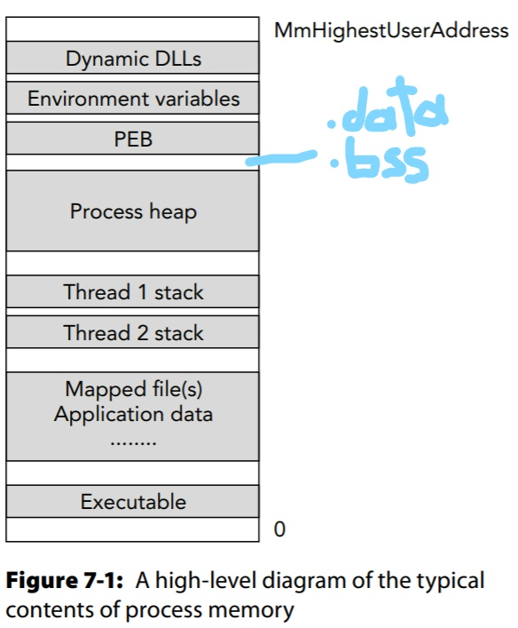
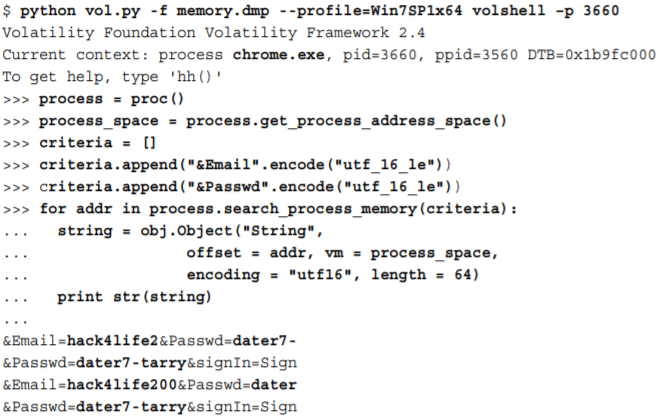

# Process Memory Internals

## Process Memory

### Address Space Layout Details

- Dynamic Linked Libraries - where shared libraries are loaded into address space by the process or by library injection attack
- Environment variables
- Process Environment Block - tell you where to find many items including DLLs, heaps, env variables, CWD, standard handles, and the **proc's command line arguments**.
- Here should be the `.data` (or `.ro`, for global or static variables) and `.bss` (for uninitialized data) 
- Process heap - majority of dynamic input the proc receives.
- Thread stacks - each thread has a dedicated range of process memory set aside. Can find function arguments, return addresses, and local variables.
- Mapped files and Application data - content depends on the proc. *Mapped files* represent content from files on disk like config data, documents, etc. *Application data* "is anything the process needs to perform its intended duties"
- Executable - primary body of code and RW variables. May be compressed or encrypted on disk but unpacked once loaded into memory.

### Memory Allocation APIs

**<u>Abstraction</u>**

#### Heap Manager

- `NtAllocateVirtualMemory` is the important/actual User mode process for heap, heap-based, and non-heap allocations.

- For example: `new` keyword calls `HeapAlloc()` which allocates the requested memory from one of the process' existing **heaps**.

#### Permissions

- Few APIs allow full control over permissions of allocated memory.
- `VirtualAlloc` does just this; allows to specify which memory should be no-access, RWX, guarded, or a combination of all.
- **Note:** Heaps are <u>*always*</u> RW. Even more, you can make a heap executable (via the `HEAP_CREATE_ENABLE_EXECUTE` parameter to `HeapCreate()`. Enter defense mechanism DEP.

	> W^X/DEP (Data Execution Prevention) - prevent attack code execution by marking data as non-executable and code as non-writable
	>
	> - "can’t have writable and executable block of memory”
	> - Does NOT defend against code reuse attacks (ret2libc, ROP)

#### Scope and Flexibility

Per the above diagram, `VirtualAllocEx` allows one process to allocate memory for another process.

- The `Ex` == *Extra* parameter is an open handle to a target process. This is used a lot in malware as a precursor to code injection (as it needs to create space in the victim process). Can also be used during SEH attacks [these overwrite address of an exception handler in a stack frame].
- This function works by reserving contiguous memory 

## Enumerating Process Memory

Sources/artifacts of process memory

- **Page Tables** - CPU-specific structs that map virtual addresses in process memory to physical offsets in RAM, can also determine which pages are swapped to disk, and analyze the hardware permissions applied to the pages. They also store the authoritative hardware access protections.
- **Virtual Address Descriptors** - Defined by Windows to track reserved/committed virtually contiguous pages. **Note**, if a region contains a memory-mapped file, the VAD will store the file's path.
- **Working set list** - Describes a collection of recently accessed pages in virtual memory that are present in physical memory (*not* swapped to disk). Usually not used for forensics as they never contain references to non-pageable memory or large pages so they aren't really reliable.
- **PFN database** - tracks the state of each page in physical memory, which is unique from the other three above which which deal with virtual memory. This can be accessed from kernel debugger data block: `_KDEBUGGER_DATA64.MmPfnDatabase`. More info can be found from [this presentation at the Open Memory Forensics Workshop](https://downloads.volatilityfoundation.org//omfw/2012/OMFW2012_Garner.pdf)

### Process Page Table

Using page tables in your investigations via `memmap` and `memdump` vol.py plugins which list and extract all pages accessible (includes kernel mode addresses) to a given process; threads can transition from user memory to kernel memory when system APIs are called.

- There is the ` KUSER_SHARED_DATA` memory region which is created by the kernel and shared with all processes. This is always found hard-coded at virtual address `0x7ffe0000`
- There are Page Size Entry (PSE) pages which are 2MB (*0x200000 hex bytes*) even though the default page size is 4KB (*0x1000* hex bytes)

When trying to dump this memory via `memmap` its *DumpFileOffset* column can be compared with the output of `memdump` per process to correlate a memory block addresses.

### Virtual Address Descriptors

For earlier notes on VAD, [see here](datastructures.md#Trees)

- A proc's VAD tree describes the memory layout at a higher level than page tables. 

- The OS maintains these structs; instead of the CPU (like in Page Tables).
- VADs contain the name of memory-mapped files, total number of pages in a region, initial protections (RWX), other flags about a given memory region.
- The parent is the root (top) of the tree
- Use `$vol.py vadtree --render=dot` which color codes by content; red=heap, green=thread, yellow=mapped-files, and gray=DLLs.

#### VAD Structures

Each process has a pointer to the root of the proc's VAD tree: `_EPROCESS.VadRoot`.

- This name is consistent across all versions of Windows; although the names of the nodes have changed.

-  The kernel decides exactly what structure to create based on the API used for allocation and the parameters passed to the API.

- These structures are naming the VadRoot and it's Nodes; `_MM*` and `_MMVAD*` respectively.

  - In the `*_LONG` versions of these structures they include much more detailed information like the *Subsection* member which the OS uses to track information on files or DLLs mapped into the region. Unlike the `*_SHORT` and `_MMVAD` structures which do not contain this useful info. This means if you are hunting for code injection and looking for evidence in the VAD tree structs you should **ONLY** be looking in the `*_LONG` structs.

  

  - `_MMVAD` is aliased to `_MMADDRESS_NODE`

#### VAD Tags

- In regards to the alias of `_MMADDRESS_NODE`, programs including vol.py know what type of structure it is aliased to via its *Tag* member in the `_MMVAD*` structure. 
- The *Tag* is at address *-0xc* (from the vol.py volshell output above) which is the *PoolTag* member of the `_POOL_HEADER` which is always directly before the node.

- When looking for injected shellcode you should look for *VadS* or *VadF* tags since the code won't be backed by a file otherwise.

#### VAD Flags

- `<unnamed-tag>` fields found in Microsoft debugging symbols because the unions don't have associated types.
- They are located in  the nodes *u* member; so looking for *_MMVAD.u.VadFlags*, or in vollshell as `dt("_MMVAD_FLAGS")`.
  - That output includes members like CommitCharge, NoChange, VadType, MemCommit, Protection, Spare, and PrivateMemory.
    - *CommitCharge* specifies the number of pages committed in the region described by the VAD node.
    - *MemCommit* tells you whether memory was committe3d when the virtual allocation API (`NtAllocateVirtualMemory`) was first called. 
    - These (*CommitCharge* and *MemCommit*) matter while looking for code injecting malware which sets up the target procs' address space (where the malicious code goes), it commits all pages first- it doesn't reserve them and then later commits.
    - The *Protection* field indicates the type of access per region. The issue is the *initial* protection specified for all pages in the range when they were first reserved/committed. However, the *current* protection can be changed (e.g. with the `PAGE_EXECUTE_READWRITE` access can change it).
      - *However*, certain tools that don't use this search method (VAD Flags), they use `VirtualQueryEx()` which doesn't search the *Protection* member.
    - The *PrivateMemory* field is for memory regions that cannot be shared with or inherited by other procs. If the field/bit is set it contains some type of the following data: heap, stack, and ranges allocated with `VirtualAlloc(Ex)`. Recall looking for that `VirtualAllocEx` function may be a sign of injected shell code.

#### Volatility VAD Plugins Walkthrough

- vol.py plugins: *vadinfo*, *vadtree*, *vaddump*

1. Pick a suspicious proc and run *vadinfo*. 

   - CommitCharge and MemCommit flags are of interest for this *(VAD)_SHORT* (child node) struct along with the  procs memory range.

   

   - This one is actually nothing of interest while looking at the flags and protection other than the fact memory has been set aside though it is not paired with any physical pages.

   

   - The *Vad* tag means they're of type *_LONG* which means there might be valuable data. Indeed there is; we see *index.dat* and *ntdll.dll* with the protection set to *PAGE_EXECUTE_WRITECOPY*!

2. Next we want to cross-reference this via volshell to prove that it is some sort of internet file. And so it is; it's a UrlCache!

3. Now let's dump that with *vaddump*. Note: you should use the *- -base* argument to dump just the needed regions. Also, recall *vaddump* will pad with zero's to solve [page swap issue](https://github.com/jklm264/My-Forensics-Notes/blob/master/Tools/Rekall_learning/Rekall_LiveMemInspect.md).
   - **Note:** `$vol.py evtlogs` plugin leverages same functionality as *vaddump* but for log files.

#### Traversing the VAD in Python

*VadRoot.traverse()* makes a VAD object for each node in the tree and then you run through each looking for a potential executable ("MZ" signature).

- **Note:** *dlllist, ldrmodules,* and *malfind* automate the finding of executables in this manner- with validators.

#### Passwords in Browser Memory

- If using a web proxy to capture outgoing POST data during a login (via Burp Suite) you can forensically find this data like so

#### Scanning Memory with Yara

Much easier (than the above method) to just do a yara scan, with the *- -wide* argument to search for Unicode too:

Can be useful for (and sources for signatures):

- Ex: `$vol.py yarascan --pid=1080,1140 --wide --yara-rules="windows-update-http.com"`
- Can add regex like so: ` $vol.py --yara-rules="/(www|net|com|org)/" --kernel`
- Searching opcodes: `$vol.py --yara-rules="{eb 90 ff e4 88 32 0d}" --dump-dir=OUTDIR`
  - To convert instructions to opcodes, use [ndisasm](https://stackoverflow.com/a/6620854/5540115) on Linux. Can also use IDAPro

## See Later

- [OMFW Conference](https://www.volatilityfoundation.org/omfw)

- [The VAD Tree: A Process-Eye View of Physical Memory](https://dfrws.org/sites/default/files/session-files/paper-the_vad_tree_-_a_process-eye_view_of_physical_memory.pdf) is short paper on VAD and Anti-forensic attacks on them
