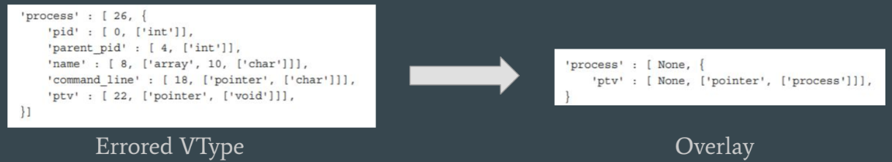
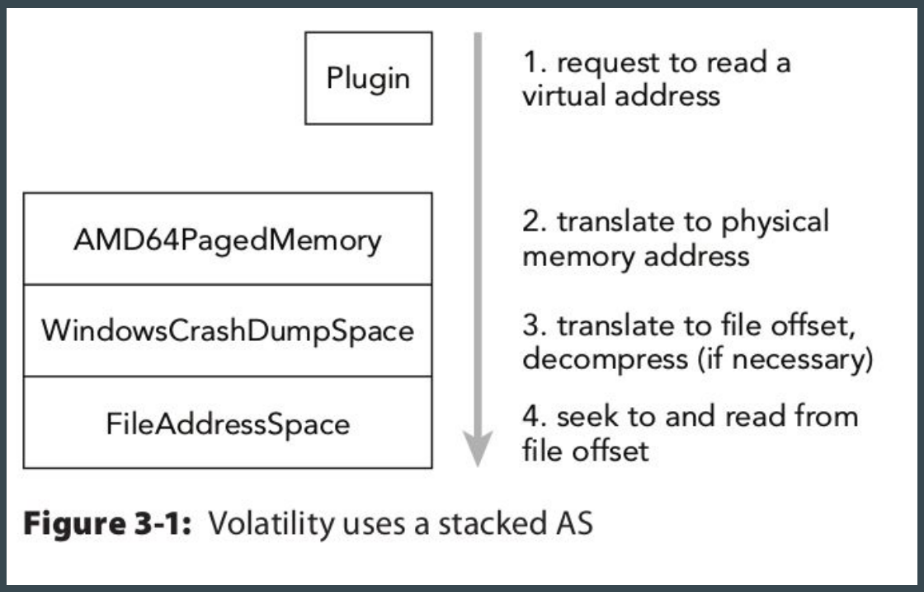

# The Volatility Framework

[Under the Hood](#Under-the-Hood)

- **NOT** an acquisition tool
- [Vol.py's github page](https://github.com/volatilityfoundation/volatility)
- Comprised of:
  - Distorm3 - disassembler for both x86 & AMD
  - Yara
  - PyCrypto
  - Python Imaging Library - screenshot plugin
  - OpenPyxl - read/write to xls

### Under the Hood

- [Week 10B](https://drive.google.com/drive/folders/1taRV0Fmar2HWfIbOBTxHGaAayzdVOEJC)

  1. VTypes

   - A representation of structures used in the OS, such as size, names, members,
     types, and offsets. Just a series of Python dictionaries!
     - [PDBParse](https://github.com/moyix/pdbparse) - Automates the creation of VTypes with ntoskrnl debug symbols

  

  2. Overlays

   - Allows a user to patch the automatically generated structure definitions; patching is required because much of the data is unknown/arbitrary at the time of allocation - so void pointers are their place holder.
     - Figured out usually after trial-and-error

  

  3. Objects

     - Instance of a VType at a specific address w/in the Address Space; think file handle.

  4. Classes

     - An instance of an **Object** that allows for the ability to attach methods or properties to an object that then become accessible to all instances of the object. This is a great way to share code between plugins and it also facilitates the use of APIs within the framework.

  5. Profiles

     - A collection of VTypes, overlays, and object classes for a specific OS & architecture. It is a requirement within volatility that each profile has a unique name for example
       Win7SP1x64.
       - Metadata - OS name, kernel version, build number
       - System call information - indexes and names of system calls
       - Constant values - globals found at hard-coded addresses in the OS
       - Native types - low-level types
       - System map (Linux and Mac) - Addresses of critical global variables and functions

  6. Address Space (AS)

     - An interface that provides flexible and consistent access to data in RAM; handles
       virtual-to-physical-address translation (with help of Profile data) AND transparently accounts for differences in memory dump file formats (for example, the proprietary headers added to Microsoft crash dumps or the compression schemes used in hibernation files).
     - Deal only with memory that is allocated and accessible, so it doesn’t currently support
       page files and swap space. (But Rekall does)

  7. AS Stacking

     

  3. Plugins

     - enable you to expand upon the existing
       Volatility Framework.

### How-To: Select a Profile

- KDBGscan - KDBG structure in Windows kernel for debugging purposes (running
  procs & loaded kernel modules
- Imageinfo - Returns data and time when the memory sample was collected, # of CPUs, characteristics of the AS (PAE?), Directory table base (DTB) which is the value used for address translation, **and KDBGscan**
- Once found, don't forget to use env vars: `$export VOLATILITY_[PROFILE,LOCATION]=""`

#### Anti-Forensics

- KDBG structure (`_KDDEBUGGER_DATA64`) in Windows kernel for debugging purposes.
- Can be overwritten and throw off the entire analysis of the data without actually corrupting the data itself since the structure is only metadata
- This attack messes up address translation, OS guess, and getting kernel objects
- [BH Euro '12 slides - One Byte Alteration](http://citeseerx.ist.psu.edu/viewdoc/download?doi=10.1.1.475.3961&rep=rep1&type=pdf)

