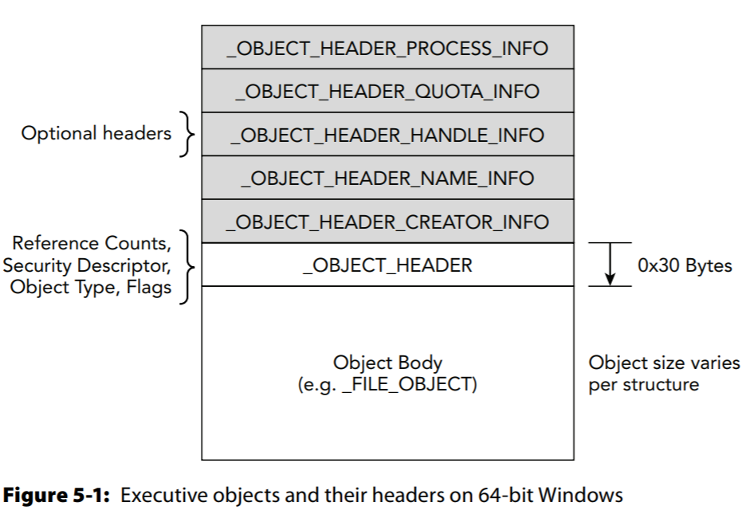
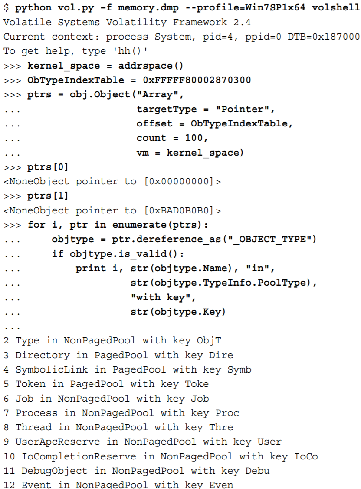
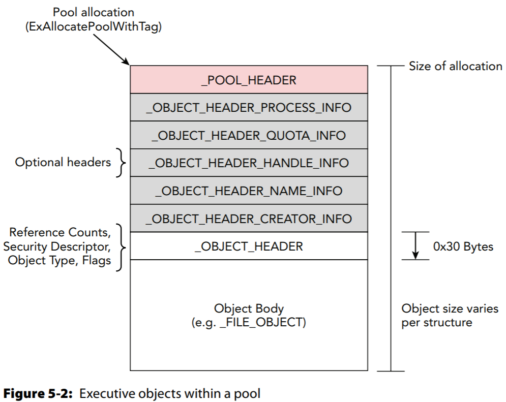
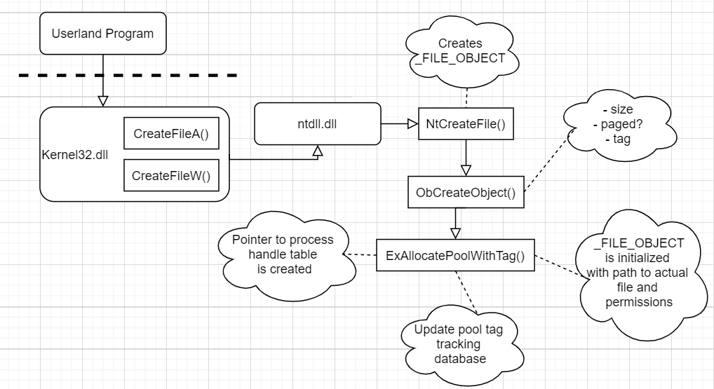
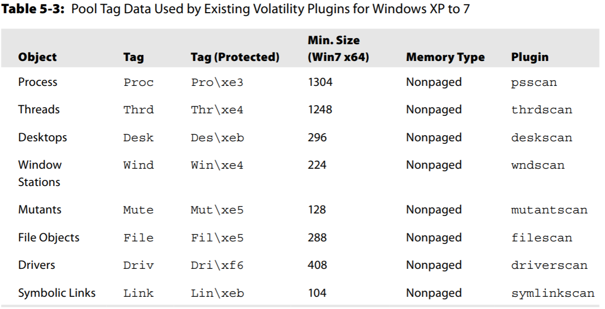

# Windows Memory Forensics

- [Steps to Create an Object](#Steps-to-Create-an-Object)
- [Pool Scanning Technique](#Pool-Tag-Scanning)

> "Artifacts are allocated."
>
> "True, but how?"
>
> "Read on to find out"

### Windows Objects and Pool Allocations

#### Windows Executive Objects

- **"Executive" being they are managed (created, protected, deleted, etc.) by the Windows Object Manager, which is part of the kernel implemented by the NT module.**
  - What really makes them executive is the headers that name, give access control permissions, and reference counters.
- Examples of Executive Objects include File (\_FILE\_OBJECT), Process (\_EPROCESS), SymbolicLink, Token, Thread (\_ETHREAD), Mutant, WindowStation, Desktop, Driver, Key, and **Type**.

  - Object types usually differ across versions because new objects are often required to support new features, and old ones are deprecated.
- Can view these objects with [GUI WinObj tool](https://docs.microsoft.com/en-us/sysinternals/downloads/winobj)

#### Object Headers

- All Executive objects have an \_OBJECT\_HEADER and 0 or more optional headers.

- In the object header (\_OBJECT\_HEADER)
  - `TypeIndex` field tells you what type of object it is (process, file, thread, socket, etc.)
  - `InfoMask` field says which of optional headers are present
  - `SecurityDescriptor` stores info on the restrictions of the object; such as which users can CRUD.
  - `PointerCount` is the number of  pointers to object
  - `HandleCount` is the number of open handles to the object
- Object body is NOT the data, it is more metadata
- Object Type Objects
  - name
  - TotalNumberOfObjects
  - TotalNumberOfHandles
  - TypeInfo - paged or not
  - Key - uniquely identifies object allocations of this type (Object)

#### Optional Headers

- Metadata that even different instances of the same object type may have different combinations of optional headers.
  - Ex: kernel doesn't track resource usage (*quota* [`_OBJECT_HEADER_QUOTA_INFO`]) for Idle or System processes
  - For forensic purposes, we like the name header; `_OBJECT_HEADER_NAME_INFO`
  - As of Win8, `_OBJECT_HEADER_AUDIT_INFO` was introduced.
- Can use `$vol.py objtypescan` to check these objects and positions. We'll mainly care about Name, Key, and PoolType
  - Can also be done via CLI ===> 

### Kernel Pool Allocations

A **Kernel pool** is a range of memory that can be divided up into smaller blocks that a kernel-mode component requests.

- Each block had a header (`_POOL_HEADER`) that can be used to attribute memory blocks to the kernel drivers that own them.
- Good for attribution during memory forensics but also to debug memory leaks/corruption issues.

#### Allocation APIs

- Before creating [executive] objects, a memory block needs to be allocated to include an object and its headers. This is done using `ExAllocatePoolWithTag` with it's member _PoolType_ being either _NonPagedPool_ (0) or _PagedPool_ (1) (there exists others like cache aligned). Its other two members are _NumberOfBytes_ and _Tag_.
- Now Executive Objects are created with `ObCreateObject`  as it will allocate not only the space needed but also will account for all the optional headers.
- Remember, some blocks won't be contiguous to one another.

#### Steps to Create an Object

1. The process calls `CreateFileA` (ASCII) or `CreateFileW `(Unicode)—both are exported by kernel32.dll.  [Can also be socket() or other types]
2. The create file APIs lead into ntdll.dll, which subsequently calls into the kernel and reaches the native `NtCreateFile` function.
3. `NtCreateFile` will call `ObCreateObject` to request a new File object type.
4. `ObCreateObject` calculates the size of `_FILE_OBJECT`, including the extra space needed for its optional headers.
5. `ObCreateObject` finds the `_OBJECT_TYPE` structure for File objects and determines whether to allocate paged or nonpaged memory, as well as the four-byte tag to use.
6. `ExAllocatePoolWithTag` is called with the appropriate size, memory type, and tag
7. Then a pointer to the object header is added to the calling process' handle table.
8. A system-wide pool tag tracking database is update accordingly .
9. The individual members of the `_FILE_OBJECT` are initialized with the path to the file being created and the requested access permissions.
10. CloseHandle() called by programmer, file will be added to "free list" and memory will persist until overwritten when memory is reallocated
    1. If file isn't closed by user/coder (closeHandle(), closeFile(), etc), the handle count will never be decremented

#### De-allocation and Reuse

- A process indicates it is finished reading or writing to a file via the `CloseHandle` function.

  => The block will then be 'released' back to the pool's "free list".

  => While here, the data will still be perfectly intact in the block of memory it was assigned; welcome to memory forensics 101.

  - The same concept applies to disk forensics. When an NTFS file is deleted, only the Master File Table (MFT) entry is modified to reflect the changed status. The file’s content remains untouched until the sectors are reassigned to a new file and write operations take place. 

### Pool Tag Scanning

The two methods for finding objects (e.g. A process) are:

1. Finding the kernel symbol that points to the starts of a doubly linked active process list and then walk
2. Pool Scanning for `Proc` tag
   - Pro's of this is it will find non-active processes still in memory just based of their tag (**unlike the first method**)
   - Defeats some rootkit hiding techniques (Ex: [Direct Kernel Object Manipulation (DKOM)](https://www.youtube.com/watch?v=dUAV9Vrwkow) and [these notes](pht.md#Detecting-DKOM-Attacks))
   - AoMF: " The advantage to the latter method [Pool Scanning] is that you can find historical entries (processes that are no longer running) as well as defeat some rootkit hiding techniques, e.g., Direct Kernel Object Manipulation (DKOM), that rely on manipulating the list(s) of active objects"

**Pool-tag scanning**, or simply **pool scanning**, refers to finding allocations based on the aforementioned four-byte tags. 

- Vol.py does this with some better false positive signature checks by looking at what memory is around the given location. Specifically, vol.py checks the allocation size and memory type.
- Note: Windows only started utilizing the pool tracker after WinXP/Win'03.

For Table 5-3, Vol.py adds the size of `_EPROCESS, _OBJECT_HEADER`, and `_POOL_HEADER` to get *Min. Size*

Note for Table 5-3, *Tag(Protected)*- which doesn't exist in Win8/WinServer'12, is the tag (bits) needed to be compared when free'ing a pool with the `ExAllocatePoolWithTag` function. The safeguard makes it so the OS can prevent drivers from accidentally freeing memory.

As an aside, it is possible a malicious kernel driver allocates entire pools to store its data

#### Pooltag File

- Some versions of the Windows Driver Development Kit and Debugging Tools or Windows include a `pooltag.txt` file.
- [PoolMon Utility](https://docs.microsoft.com/en-us/windows-hardware/drivers/devtest/poolmon) reports live updates about the pool tags that are in use on a system as well as other audit information import 
  - **Fun Fact:** The Configuration Manager, which is the kernel component that maintains the Windows Registry
- Another tool called [!poolfind.exe](https://docs.microsoft.com/en-us/windows-hardware/drivers/debugger/-poolfind) which is part of the Windows Kernel Debugger. Not at cool or useful though.

#### Pool Tracker Tables

Tools like PoolMon are great for live system analysis, but what about if you only have memory dumps? Check the tracker table!

**Note: The Pool Tracker Table only has usage statistics, not address or meaningful names.**

To access these, we check the kernel debugger data block (aka `_KDDEBUGGER_DATA64`) that stores active processes and loaded module lists. This data block has a member called `PoolTrackTable` which points to an arraly of `_POOL_TRACKER_TABLE` structures (one for each unique pool tag). The has been automated via the *pooltracker* vol.py plugin.

​	- Usually run `$vol.py pooltracker –tags=Proc,File,Driv,Thre`. Can even use `--tagefile pooltag.txt`

#### Building a Pool Scanner

- `vol.py psscan` will search for the *_EPROCESS*  structure name; just like filescan scans for *FILE_OBJECT* handles ([src](https://digital-forensics.sans.org/media/volatility-memory-forensics-cheat-sheet.pdf))

- Note `psscan` shows the "Time exited" or the time processes have terminated. This means the method of walking through an active process list would not show these processes.

#### Limitations on Pool Scanning

##### Non Malicious Limits

- Untagged pool memory occurs when a driver/coder uses the ExAllocatePool() instead of the recommended ExAllocatePoolWithTag().
- False positives because you are scanning all physical memory. To resolve, consider the context (where it was found, etc).
- Large allocations- Does not work for allocations larger than 4096B (1 page) though Executive Objects are all less than that size.

##### Malicious Limits

- Arbitrary tags - Driver's can use generic tags or those with spaces (like "Ddk<space>")
- Decoy tags ([Blackhat Aaron Walters](https://www.blackhat.com/presentations/bh-dc-07/Walters/Presentation/bh-dc-07-Walters-up.pdf)) - a driver that creates objects to mislead and increase SNR
- Manipulated tags - rootkits will modify the pool tags (or any value in the header). Since it's metadata there really won't be a noticeable difference on the live machine.

#### Big Page Pool

- Windows tries to group similarly sized allocations together, but when the size exceeds a page (4096B) the block of memory is allocated from the reserved *big page pool*
- Pooltag scanning will fail here because the tag (, contained in the *_POOL_HEADER*) is not used as all.
- Uses Big Page Track Tables

##### Big Page Track Tables

- The small `_POOL_TRACKER_TABLE` store stats but not address locations which is why you need to scan tags
- For larger blocks, `_POOL_TRACKER_BIG_PAGES` include addresses.

- `bigpools` is a vol.py plugin

##### Explore Big Page Pools

- List the allocations by tag and sort by frequency

`$vol.py bigpools > bigpools; awk '{print $2}' bigpools.txt | sort | uniq -c | sort -rn`

#### Pool Scanning Alternatives

- Dispatcher Header Scans
  - other threads can synchronize with, or wait on, executive objects to start, finish, or perform another type of action.
  - The kernel stores info about an object's current state in the `_DISPATCHER_HEADER` structure that is at the very start of the executive object
  - A 4-byte signature  (other than the pool tag) can be scanned to find _EPROCESS objects. This was how PTFinder tool worked! Unfortunately, this only found objects that were synchronizable. Objects that are not (like files) do not have _DISPATCHER_HEADER. [Andreas Schuster's Searching for Processes and Threads in Microsoft Windows Memory](https://www.dfrws.org/sites/default/files/session-files/pres-searching_for_processes_and_threads_in_microsoft_windows_memory_dumps.pdf)
- Robust Signature Scans
  - Is resilient against modifying these tags/signatures
  - It worked by fuzzing machines until they BSoD
  - `$vol.py psscan3`
  - [Robust signatures for kernel data structures](https://dl.acm.org/doi/10.1145/1653662.1653730)